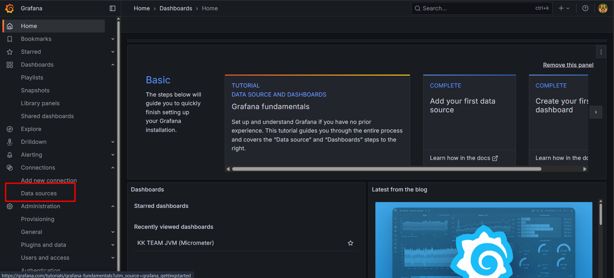
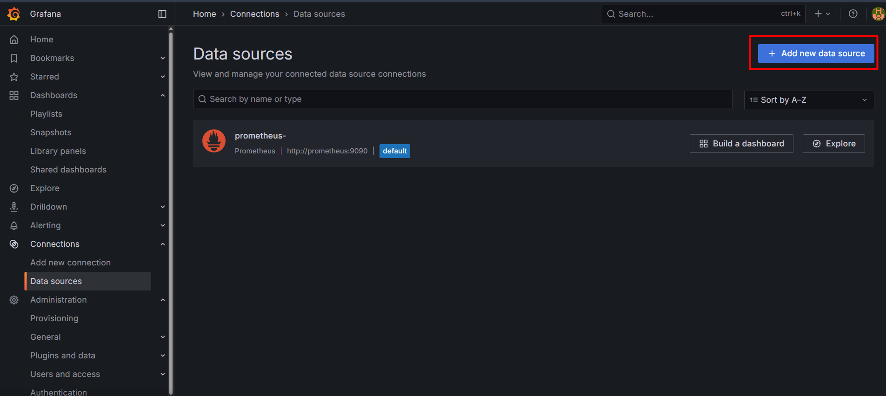
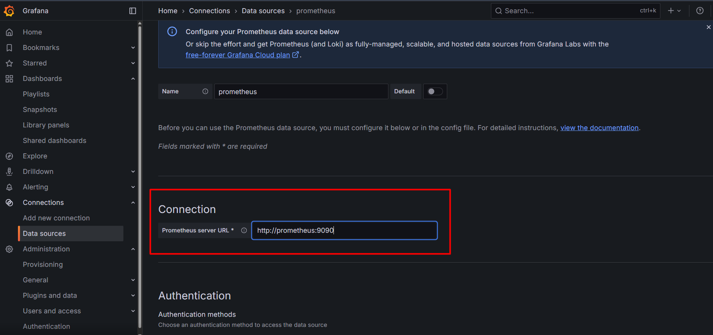
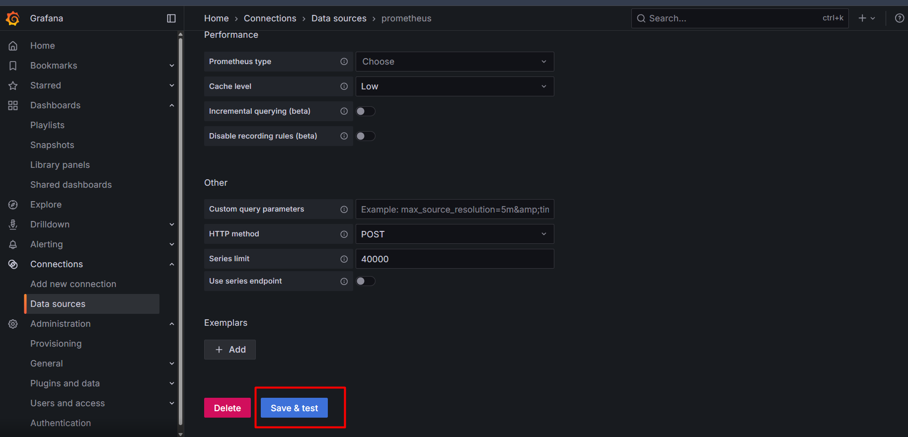
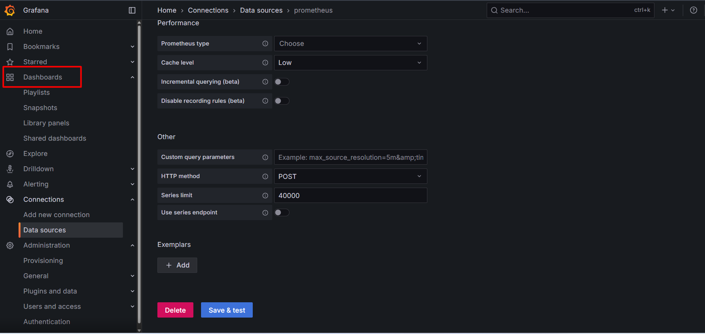
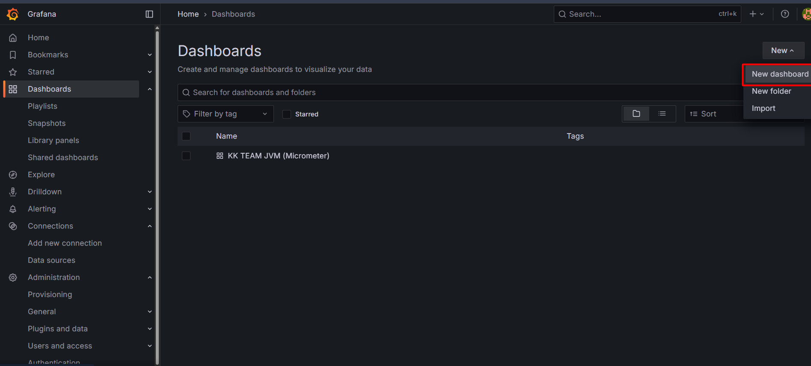
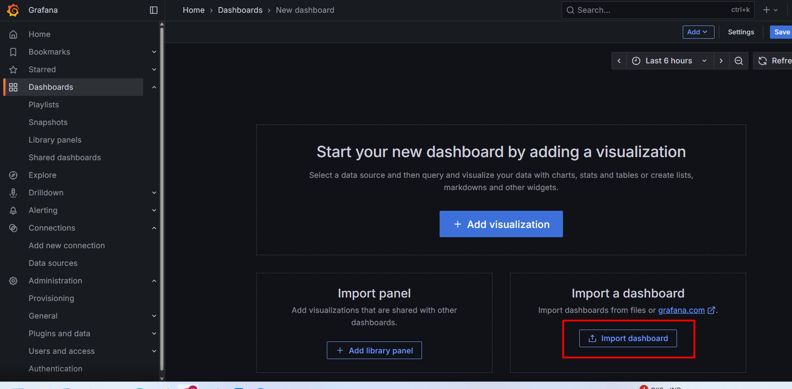
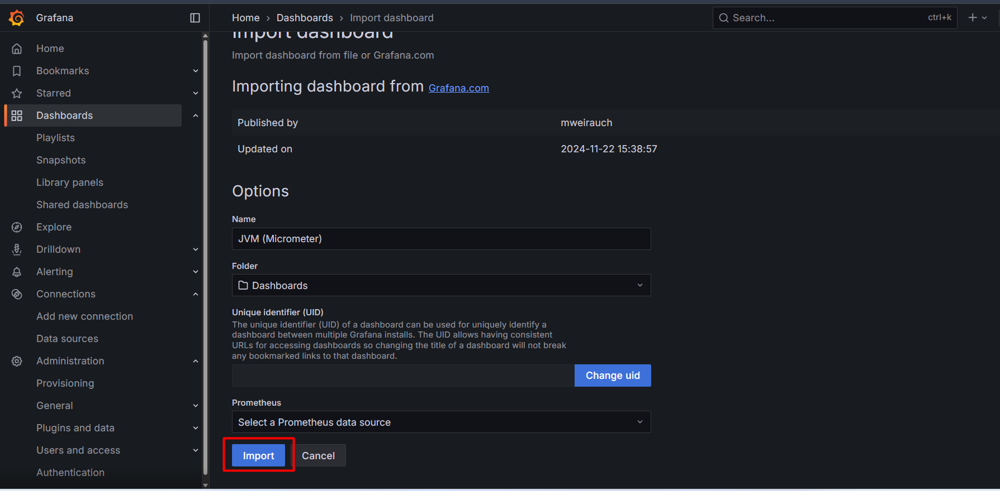
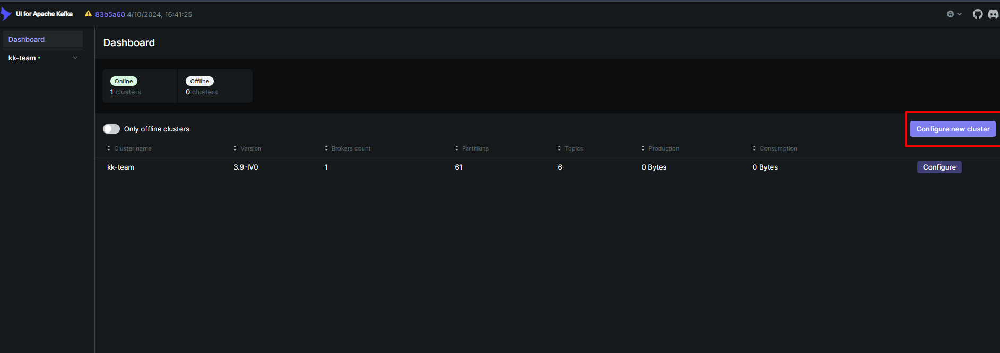
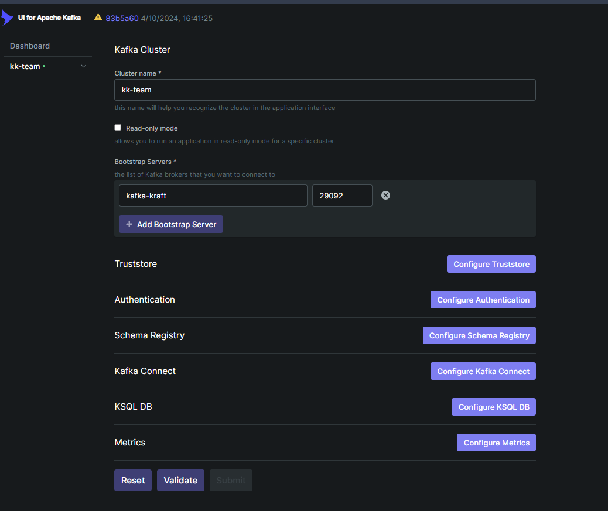

## Môi trường bắt buộc để chạy ứng dụng
- [x] Hệ thống chạy trên nền Java 21
- [x] sử dụng kafka để thực hiện message queue
- [x] Sử dụng consul để thực hiện discovery
- [x] Sử dụng Zipkin để thực hiện tracing
- [x] Sử dụng Prometheus để ghi log metrics hệ thống
- [x] sử dụng Grafana để giao diện hoá metrics
- [ ] Docker để chạy docker compose với hỗ trợ thư viện chạy hệ thống or download binary

## Thực hiện chạy hệ thống
1. Run docker compose <br>```docker compose up -d```<hr>
2. Run common lib <br> ```cd commib-lib``` <br>```mvn clean install -DskipTests```<hr>
3. Installation via service <br> ```mvn clean install -DskipTests```
---
## Thư viện ứng dụng
| Description                                         | URL                           |
|:----------------------------------------------------|:------------------------------|
| Kiểm tra Discovery với consul                       | http://localhost:8500/ui      
| Kiểm tra hàng đợi tin nhắn kafka-ui                 | http://localhost:9089         
| Kiểm tra tracing với Zipkin                         | http://localhost:9411/zipkin/ 
| Kiểm tra service ghi metrics với Prometheus         | http://localhost:9090/targets 
| Kiểm tra metrics với Grafana(Tài khoản admin/admin) | http://localhost:3000         

---
### Cấu hình dashboard Grafana
1. Màn hình `HOME` click `Data sources`
2. Click Button `Add data source`
3. Choose time series database <b>Prometheus</b>
4. Enter connection prometheus server URL `http://prometheus:9090`
5. Click Button `Save & test`
6. Màn hình `HOME` click `Dashboard`
7. Click Button `create dashboard`
8. Click Button `import dashboard`
9. Enter grafana ID or creating (Id template 4701) Click Button `Load`
10. I'm want change options, success Click button `import`
---
### Cấu hình Ui Kafka
1. Tại màn hình `HOME Dashboard`
2. Click Button `Configure new cluster`
3. Enter bootstrap server 
4. Click button Submit
---

### Truy cập vào postgresql
| Phần                                                                                                       | Mục đích                                                                                  | Dựa trên cấu hình docker-compose  |
|:---------|:---------|:-------------|
| docker exec -it                                                                                            | Thực thi một lệnh (psql) trong container đang chạy.                                       | Lệnh chung của Docker.            |
| postgres_security| Tên của container (đã định nghĩa trong container_name).| container_name: postgres_security |
| psql| Lệnh client để kết nối với cơ sở dữ liệu PostgreSQL.| Lệnh gốc của PostgreSQL.          |
| -U postgres| Chỉ định User để kết nối.| POSTGRES_USER=postgres            |
| jwtsercurity| Chỉ định Database để kết nối.| POSTGRES_DB=jwtsercurity          |
```shell
docker exec -it postgres_security psql -U postgres jwtsercurity
```

### Guides
The following guides illustrate how to use some features concretely:

* [Resilience4J](https://docs.spring.io/spring-cloud-circuitbreaker/reference/index.html)
* [LoadBalancer](https://docs.spring.io/spring-cloud-commons/reference/spring-cloud-commons/loadbalancer.html)
* [Consul](https://docs.spring.io/spring-cloud-consul/docs/current/reference/html/)
* [Gateway](https://docs.spring.io/spring-cloud-gateway/reference/spring-cloud-gateway-server-mvc.html)
